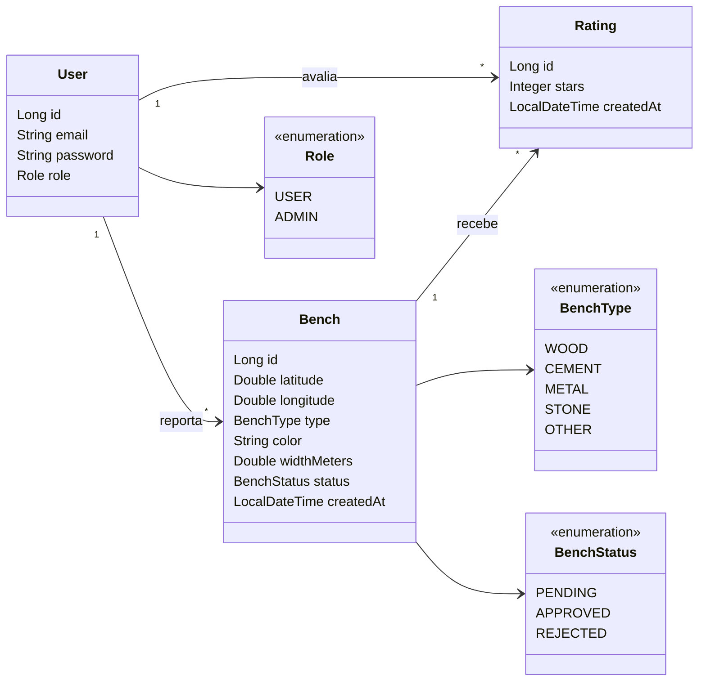

# Diagrama de Classes — Find

Diagrama das entidades principais do domínio (backend Java / JPA).

## Descrição das relações

| Relação | Cardinalidade | Descrição |
|---------|---------------|-----------|
| User → Bench | 1:N | Um utilizador pode reportar vários bancos |
| User → Rating | 1:N | Um utilizador pode avaliar vários bancos |
| Bench → Rating | 1:N | Um banco pode ter várias avaliações |
| User + Bench → Rating | único | Um utilizador só pode avaliar o mesmo banco uma vez |

## Pacotes relacionados

- Entidades: `pt.iade.find.model`
- Repositórios: `pt.iade.find.repository`
- Serviços: `pt.iade.find.service`
- Controllers: `pt.iade.find.controller`
